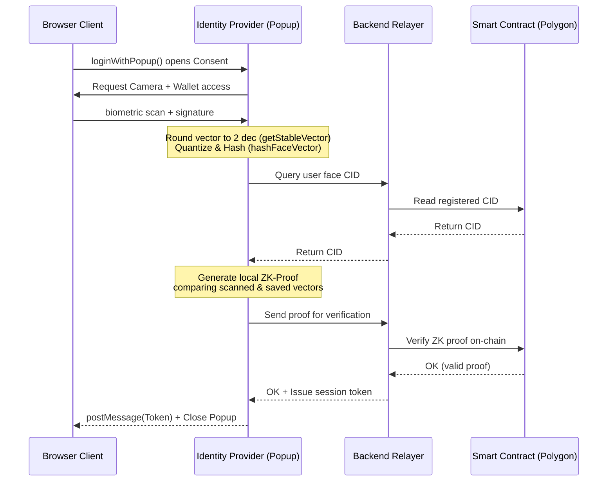

# @praman-network/sdk

[](https://www.npmjs.com/package/@praman-network/sdk)
[](#)
[](#)
[](#)

PramanAuth is a decentralized Identity-as-a-Service (IaaS) SDK that brings privacy-preserving, Zero-Knowledge (ZK) biometric authentication to Web3 applications. Under a hybrid Web2.5 Relayer architecture, users log in or register via a clean, popup-based consent and facial scan flow, entirely without paying gas fees or needing browser wallet confirmation popups.

---

## Why PramanAuth?

Modern authentication solutions force a trade-off between convenience and security. PramanAuth eliminates this compromise by combining high-fidelity biometrics with zero-knowledge cryptography:

*   **Zero Biometric Storage:** We do not store raw images, video frames, or facial descriptors on any centralized server. Biometric matching templates are encrypted client-side using wallet signatures before being archived on IPFS.
*   **Decentralized ZK-Verification:** Biometric verification is computed directly in the user's browser using client-side **Groth16 ZK-SNARK Proving (via SnarkJS)**. Only the zero-knowledge proof is sent to the blockchain, keeping raw biometrics completely private.
*   **Gasless UX:** All blockchain writes, gas sponsorship, and storage interactions are delegated to our secure Backend Relayer. Users get a fast, seamless "Sign In with Google"-like experience.

---

## Quickstart

### 1. Installation

Install the core package in your React, Next.js, or Vite frontend application:

```bash
npm install @praman-network/sdk
```

### 2. Initialization

Initialize the SDK instance inside your app config or root component. Pass your API key, preferred network, and production URLs:

```typescript
import { initPraman } from '@praman-network/sdk';

const praman = initPraman({
  apiKey: "YOUR_API_KEY",
  network: "polygon-amoy",
  idpUrl: "https://auth.praman.network",   // Standard hosted Identity Provider URL
  backendUrl: "https://api.praman.network" // Deployed Backend Relayer API URL
});
```

### 3. Triggering Popup Authentication (OAuth/Firebase Style)

Call `loginWithPopup()` or `registerWithPopup()` to open a centered consent window that verifies the user and returns user claims and a decentralized JWT.

```typescript
import React, { useState } from 'react';
import { initPraman } from '@praman-network/sdk';

const pramanAuth = initPraman({
  apiKey: "YOUR_API_KEY",
  network: "polygon-amoy",
  idpUrl: "https://auth.praman.network",
  backendUrl: "https://api.praman.network"
});

export function App() {
  const [user, setUser] = useState<any>(null);
  const [loading, setLoading] = useState(false);
  const [error, setError] = useState<string | null>(null);

  const handleLogin = async () => {
    setLoading(true);
    setError(null);
    try {
      // Launches centered popup, handles the consent screen, and runs ZK face verification
      const result = await pramanAuth.loginWithPopup({
        scopes: ['email', 'profile'],
      });

      if (result.success) {
        setUser(result.user);
        console.log("Session Token:", result.token);
        console.log("ZK Proof Object:", result.proof);
      }
    } catch (err: any) {
      setError(err.message || 'Authentication failed');
    } finally {
      setLoading(false);
    }
  };

  return (
    <div style={{ padding: '24px', fontFamily: 'sans-serif' }}>
      <h2>PramanAuth Web3 Sign-In</h2>
      
      {user ? (
        <div>
          <p><strong>Decentralized ID (DID):</strong> {user.did}</p>
          {user.email && <p><strong>Email Address:</strong> {user.email}</p>}
          <button onClick={() => setUser(null)}>Logout</button>
        </div>
      ) : (
        <button onClick={handleLogin} disabled={loading}>
          {loading ? 'Opening Popup...' : 'Sign In with PramanAuth'}
        </button>
      )}

      {error && <p style={{ color: 'red', marginTop: '12px' }}>Error: {error}</p>}
    </div>
  );
}
```

### 4. Registration Flow

Onboard new users to the smart contract using `registerWithPopup()`. This flow guides them through inputting optional details and performing their first biometric baseline scan:

```typescript
const handleRegister = async () => {
  try {
    const result = await pramanAuth.registerWithPopup({
      scopes: ['email', 'profile']
    });
    if (result.success) {
      alert(`User registered successfully! DID: ${result.user.did}`);
    }
  } catch (err: any) {
    alert("Registration failed: " + err.message);
  }
};
```

---

## Core Concepts

PramanAuth operates on a privacy-first Web3 paradigm:



1.  **Face Vector Normalization & Hashing:** The face API generates a 128-dimensional array. The SDK runs it through `getStableVector()` (rounding to 2 decimals to eliminate scan/noise non-determinism) and hashes it with Keccak256.
2.  **IPFS Pinned Enclaves:** User biographical fields are encrypted client-side using wallet signatures and lit protocol, then pinned as IPFS metadata.
3.  **Local ZK Proving:** For login, the system downloads the encrypted reference vector, decrypts it locally, and generates a zero-knowledge Groth16 proof demonstrating that the Euclidean distance between the current face vector and the reference vector falls within strict liveness boundaries.

---

## Production Hardening

### Environment Guard

The PramanAuth SDK includes an **Environment Guard** that automatically determines when to run in strict mode.

> [!WARNING]
> In production environments (i.e. `process.env.NODE_ENV === 'production'` or `import.meta.env.MODE === 'production'`), the SDK enforces a strict **hard-fail** policy. If ZK proof generation fails due to memory exhaustion, network drops, or missing configuration assets, the login fails. Mock fallbacks are strictly disabled in production.

### Backend Token Verification & Mock Filtering

When your backend API receives the PramanAuth JWT token from the client, you must verify the signature and filter out mock identities.

> [!IMPORTANT]
> Always verify the `is_mock` claim in the decoded JWT payload. If `is_mock: true` is detected in a production build, your backend **must** reject the authentication session immediately to prevent bypass exploits.

```typescript
import { verifyToken } from '@praman-network/sdk'; // On Node.js backends

const result = verifyToken(receivedToken);
if (!result.valid) {
  throw new Error("Invalid cryptographic session token");
}

if (result.payload.is_mock && process.env.NODE_ENV === 'production') {
  throw new Error("Unauthorized: Mock tokens are restricted in production environments");
}
```

---

## Developer Experience & Troubleshooting

### Common Troubleshooting

#### 1. Why does my registration fail with "Biometric face identity already registered"?
This occurs because the contract's unique Sybil check detected that your face descriptor hash is already associated with an existing master wallet. During development, you can use the `is_mock` config flags or clear state from the deployed smart contract.

#### 2. CORS Errors connecting to Backend Relayer
Ensure your deployed verify-endpoint backend has set the proper allowed CORS origin. In production mode, wildcards (`*`) are disabled, and the relayer restricts requests to authorized domains (e.g. `https://auth.praman.network`).

#### 3. ZK Proof Generation takes too long or crashes the browser
Ensure that your development build is not bottlenecked by heavy source-map generations. If building for mobile or resource-constrained devices, verify that WebAssembly support is fully enabled in the target browser environment.

---

## Changelog

*   **`v0.1.2` (Current)**
    *   Implemented `getStableVector` normalization layer inside biometrics engine to stabilize face descriptor hashes.
    *   Added dynamic `idpUrl` and `backendUrl` config bindings for production environments.
*   **`v0.1.1`**
    *   Implemented popup-based OAuth Consent screens and window-opener message listeners.
*   **`v0.1.0`**
    *   Initial release of basic face scanning, Lit protocol encryption, and gasless transaction relayers.

---

## Get Involved

PramanAuth is open-source. Help us build a safer, passwordless, decentralized future for Web3 applications:

*   **GitHub Repository:** [Praman-Network/AuthPramanNetwork](https://github.com/Praman-Network/AuthPramanNetwork)
*   **Contribute:** Submit pull requests or open feature requests in our GitHub issues.
*   **Support:** Reach out to the core engineering team for API keys and developer support.
